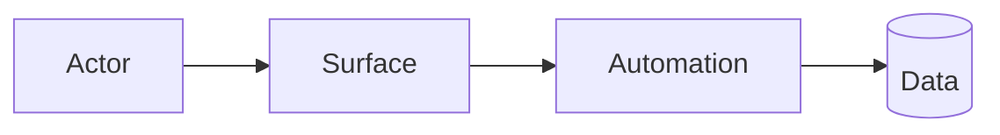
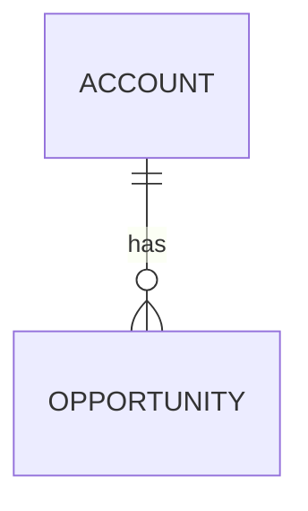
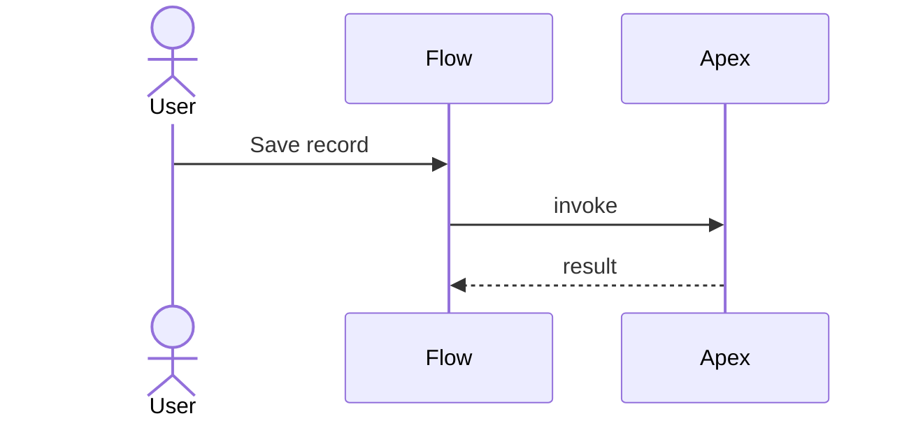

# TDD — <Feature name>

| | |
|---|---|
| **Ticket / Epic** | <ID + link> |
| **Author** | <name> |
| **Status** | Draft / In review / Approved |
| **Version** | 0.1 |
| **Date** | <YYYY-MM-DD> |
| **Reviewers** | <architect, tech lead> |
| **Target release** | <sprint / date> |

## Open questions

| # | Question | Owner | Blocking? |
|---|----------|-------|-----------|

*Delete this section only when it is genuinely empty.*

---

## 1. Purpose & scope

One paragraph: what this builds and why. Then:

**In scope**
- …

**Out of scope**
- … *(name the things a reader would reasonably assume are included)*

**Assumptions**
- …

**Dependencies** — other teams, orgs, licences, packages, data.

## 2. Requirements

| # | Requirement | Acceptance criteria | Source |
|---|-------------|---------------------|--------|
| R1 | | | |

**Non-functional**

| Attribute | Target |
|-----------|--------|
| Record volume | |
| Concurrent users | |
| Response time | |
| Integration frequency / SLA | |
| Retention | |

## 3. Solution overview

Two or three paragraphs of prose, then a diagram of the moving parts.

### Design decisions

| # | Decision | Rationale | Rejected alternative |
|---|----------|-----------|----------------------|
| D1 | | | |

## 4. Data model

### New / changed objects

| Object | API name | New? | Sharing | Record types | Notes |
|--------|----------|------|---------|--------------|-------|

### Fields

| Object | Field label | API name | Type | Req | Unique | Ext ID | Default | Notes |
|--------|-------------|----------|------|-----|--------|--------|---------|-------|

### Relationships

| Child | Parent | Type | Delete behaviour | Reparentable |
|-------|--------|------|------------------|--------------|

## 5. Component design

| Component | Type | Responsibility | Invoked by |
|-----------|------|----------------|------------|

Per component, a short subsection covering entry point, inputs/outputs, error handling and
bulk behaviour.

### Order of execution

Every object with more than one automation:

| Object | # | Automation | Type | Context | Notes |
|--------|---|------------|------|---------|-------|

## 6. User experience

Pages, layouts, Lightning components, screen flow steps, permissions per persona. Include
wireframes or a screen-by-screen list. State the mobile behaviour or say it is unsupported.

## 7. Integrations

| # | System | Direction | Protocol | Auth | Frequency | Volume |
|---|--------|-----------|----------|------|-----------|--------|

Per integration: endpoint, request/response shape, error handling, retry policy,
idempotency, monitoring, and the governor limits that constrain it.

## 8. Security & compliance

- **Permission sets / profiles** —
- **Sharing model** — OWD, sharing rules, manual/Apex sharing
- **Apex sharing context** — per class, `with`/`without`/`inherited sharing` + justification
- **FLS & CRUD enforcement** —
- **PII / regulated data** —
- **Named Credentials** — no secret is stored in metadata or custom settings

## 9. Limits, scale & error handling

| Concern | Expected | Limit | Headroom |
|---------|----------|-------|----------|
| SOQL per transaction | | 100 | |
| DML per transaction | | 150 | |
| Heap | | 6 MB / 12 MB async | |
| Callouts | | 100 | |

Error handling: what the user sees, what is logged, where, and who is alerted.

## 10. Test strategy

| Layer | Scope | Owner |
|-------|-------|-------|
| Unit (Apex) | ≥ 75% per class, meaningful asserts | Dev |
| Bulk | 200-record cases | Dev |
| Negative | | Dev |
| Integration | | Dev/QA |
| UAT | Mapped to R1…Rn | Business |

## 11. Deployment

**Components**

| # | Component | Type | Notes |
|---|-----------|------|-------|

**Order** — metadata first, then data, then manual steps.

**Manual / post-deployment steps** *(things that cannot be deployed)*
1. …

**Rollback** — how to get back, and what data becomes unrecoverable if you do.

## 12. Appendix

Glossary, references, related documents.
